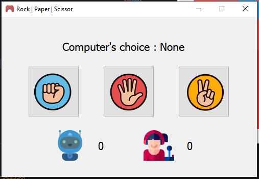

# Rock | 📄 Paper | ✂️ Scissor - PyQt5 Game
---

A simple desktop Rock | Paper | Scissor game built using *Python* and *PyQt5 GUI Framework*.
---

---

## 👨‍💻 Author
**Saptapan Barua**
---

## 🎮 Features
- 🧠 Bot vs Player Gameplay  
- 🖼️ Beautiful PyQt5 GUI  
- 📊 Score tracking  
- 🎯 Random Bot Choice  
- 🏆 Win dialog with options to play again or exit  
- 🔒 Fixed Window Size  
- 📌 Game ends when either the player or bot reaches 5 points  

---

## 🛠️ How to Run instructions

### 1. Clone the Repository
You can clone your project repository using git.
```bash
git clone https://github.com/saptapanBarua/Rock-Paper-Scissor-PyQt5-Game.git
cd rock-paper-scissor-pyqt5
```

### 2. 📦 install requirements
Before running the game, make sure Python and pip are installed. Then install PyQt5 using:
```bash
pip install PyQt5
```
or You may optionally create a virtual environment to avoid system-wide installation:
```bash
python -m venv venv
source venv/bin/activate  # On Linux/macOS
venv\Scripts\activate     # On Windows
pip install PyQt5
```

### 3. 🚀 How to run
✅ Make sure the following folder and files are present:
```bash
assets/
├── game.png
├── rock.png
├── paper.png
├── scissor.png
├── bot.png
└── gamer.png
```
Run the Python script using:
```bash
python main.py
```
---

### 🔧 Bug Fixes (Next Version)
- Use safer font names
- Improve screen compatibility
- Use enum or constants for player choices
- Better dialog button checking using roles
- Add sounds and animations for better user experience
